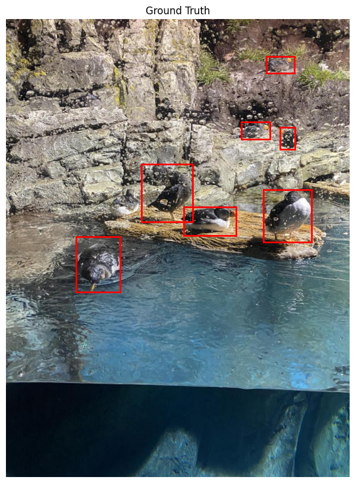

# Object Detection Case Study – Underwater Dataset

## Shani Israelov 

This is a self-study case study I did to practice object detection methodology. I used the underwater dataset from Kaggle.
It is a small dataset representing challenges we can face in many real-world scenarios. The size of the dataset here is the main challenge, and we will try to get the best results we can. This is a work in progress.
Since my dataset is small, our approach will be to take a pre-trained model, change the last layer to fit the categories, and fine-tune only this layer on our dataset.
The model I’m using here is Faster R-CNN. The advantage is that it is simple to use since PyTorch includes it. The application is not for real-time use, and accuracy is the most important metric here.

This report goes as follows: we will start with Background on Faster R-CNN – beginning with R-CNN, discussing the loss function, and showing the modifications we made to the model. Then, we will cover EDA (Exploratory Data Analysis) – exploring how the data looks, its distribution, and the challenges we face. Here, we will discuss imbalance, augmentation, and WeightedRandomSampling. Moving on to the exciting part, training, we will discuss what we are training, how we can perform hyperparameter tuning using Weights & Biases, optimizer selection, and learning rate adjustments. Next, we will address Evaluation Metrics – explaining how we evaluate our results, including mAP and the confusion matrix. Finally, since this is a work in progress, I will share future directions and other experiments I intend to perform.

   ---

## Table of Contents
1. [Background on Faster R-CNN](#background-on-faster-r-cnn)  
   - R-CNN, Fast RCNN, Faster RCNN
   - Loss function  
   - Modifications  

2. [Exploratory Data Analysis (EDA)](#exploratory-data-analysis-eda)  
   - Dataset distribution  
   - Class imbalance and Over-Sampling
   - Data augmentation strategies  

3. [Training the Model](#training-the-model)  
   - Training objectives  
   - Hyperparameter tuning with **Weights & Biases**  
   - Optimizer selection  
   - Learning rate adjustments  

4. [Evaluation Metrics](#evaluation-metrics)  
   - How we measure performance  
   - Understanding **mAP (Mean Average Precision)**  
   - Confusion matrix analysis  

5. [Future Directions](#future-directions)  

---
## Background on Faster R-CNN  

### R-CNN Family 

I will start with RCNN, the first work in this family of region convulotional nueral networks.

Inference Time:
1) Region Proposal - we divide the image to regions using external methods like selective search or edgeboxes. around 2000 proposal per image.
2) Wrapping - we wrap the proposal region to fit it to the cnn input size
3) Feature Extraction - using CNN like AlexNet or ResNet we can extract from the image a feature vector, usually high dimention like 4096, this vector represents the content of the region proposal. 
5) Object Classification - category specific linear SVM. it was trained on negative sample, where the object is missing, positive samples, where the object is present, and for the inbetween cases, they used IoU overlap threshold that was selected by a grid search. they prefered SVM over the Softmax of the CNN. 
note: so if we have 2000 proposal per image, and each proposal was forward pass to the CNN and resulted in high dimension vector, is means we have 2000x4096 matrix, and the size of the SVN is 4096xN (N num of classes) because we have different SVN per class. 
6) Bounding Box - we train the regressor using pairs of {P,G} to each class. P is for the proposal and G is for the ground trught. each contain x,y coordinates of the center of the box and w,h the with and hieght. we learnt a linear model that transform P into G^ by optimizing the regularized least squares objective.
7) NMS - non maximum suppression to remove highly overlapped bounding boxes. 

Training of the CNN:
1) change the last layer to N+1 classification layer
2) supervised pre training - only labels no bounding boxes.
3) domain specific fine tuning - continue training with the wraped region proposals and biased the sampling towards positive samples. (which are rare compared to the background).
   


images from [mathworks](https://www.mathworks.com/help/vision/ug/getting-started-with-r-cnn-fast-r-cnn-and-faster-r-cnn.html)

Faster R-CNN model

### Loss

the loss - what are we training on?

The loss function in Faster R-CNN consists of two main components:

Region Proposal Network (RPN) Loss: the RPN responsible got generating region proposals. 
it takes feature map from the backbone network, in our case ResNet50, and output set of anchor boxes with objectness scores and bounding box refinments. 
The RPN loss consist of classification loss and regression loss. 

the classification loss determines whether an anchor contains an object or background, uses **binary-cross enthropy loss** object vs background.
the regression loss adjusts the anchor box coordinates to better fit the ground truth, uses **smooth l1 loss** between the predicted trasformation for an anchor and the transformation needed to align with the ground truth. 

Region-based CNN (Fast R-CNN) Loss: this loss is also consist from classification and regression loss but in this time we are after the regions were RoI Pooled and passed through a classifier and a regressor. this time the classification is for multi-class and it uses cross enthropy loss, and the regression is smooth l1 loss that further refined the bounding box coordinates. 


### Modifications 
there are 4 faster rcnn model builders in [PyTorch](https://pytorch.org/vision/master/models/faster_rcnn.html):
1) fasterrcnn_resnet50_fpn(*[, weights, ...]) Faster R-CNN model with a ResNet-50-FPN backbone from the Faster R-CNN: Towards Real-Time Object Detection with Region Proposal Networks paper.
2) fasterrcnn_resnet50_fpn_v2(*[, weights, ...]) Constructs an improved Faster R-CNN model with a ResNet-50-FPN backbone from Benchmarking Detection Transfer Learning with Vision Transformers paper.
3) fasterrcnn_mobilenet_v3_large_fpn(*[, ...]) Constructs a high resolution Faster R-CNN model with a MobileNetV3-Large FPN backbone.
4) fasterrcnn_mobilenet_v3_large_320_fpn(*[, ...]) Low resolution Faster R-CNN model with a MobileNetV3-Large backbone tuned for mobile use cases.

first im using the first option:
```
fasterrcnn = fasterrcnn_resnet50_fpn(pretrained=True)
```

- Backbone with FPN
    - Intermediate Layer Getter - is the body, here is the ResNet50
    - Feature Pyramid Network
- Region Proposal Network
    - RPN Head    
    - Anchor Generator
- ROI Heads
    - Multi Scale
    - Two MLP
    - Box Predictor

we modify the box predictor to adjust the number of classes
```
num_classes = 8  # 7 classes + 1 background
in_features = fasterrcnn.roi_heads.box_predictor.cls_score.in_features  # Get the number of input features
fasterrcnn.roi_heads.box_predictor = FastRCNNPredictor(in_features, num_classes)  # Replace with new predictor
```

```
# Freeze all layers
for param in model.parameters():
    param.requires_grad = False

# Unfreeze specific layers
for param in model.model.roi_heads.box_predictor.parameters():  # Access the underlying model
    param.requires_grad = True
```

torchinfo to print the model summary:


---

## Exploratory Data Analysis (EDA)

### Dataset Overview 
 
before understaind the data lets first recheck the bounding box the labels. 


when visualizing we can find errors so this is very important and i recomand to run it not only on one batch. 

### YOLO to Faster RCNN

one the problems i encountered and noticed when visualizing, i saw there was an offset between the classes, shark was consistently misclassifed as stirngifish.
this had happen because of the ffirence of yolo and faster rcnn formats for bounding boxes and labels.
this dataset is given in YOLO format, so let take a moment to mention the difference between these formats:

YOLO represents bounding boxes in relative (normalized) format using 5 values per object:
[class_id] [x_center] [y_center] [width] [height]
 Class index (starting from 0). x_center, y_center → The center of the bounding box as a fraction of the image width & height (values between 0 and 1).
width, height → Box dimensions as a fraction of the image width & height.

Faster R-CNN uses absolute pixel values in the format:
[x_min, y_min, x_max, y_max]
(x_min, y_min) = Top-left corner of the box.
(x_max, y_max) = Bottom-right corner of the box.

### Plots
we can clearly see a huge class imbalance.


### Dealing with Class Imbalance
I used WeightedRandomSampler 
make sure to apply seed if you want to keep your expiriment consistent, cuz it will give sligtly different distribution, 
the distribution is still imbalance so there is work to do. 
suggestions:
Selective Augmentation for Rare Classes – Apply Albumentations only for rare object images.
Class-Balanced Sampling – Make sure rare classes appear in every batch.
Focal Loss – Helps reduce dominance of common classes like fish.
Adjust Anchor Sizes – If small rare objects are missing.
Lower Detection Thresholds for Rare Classes – If they're predicted with low confidence

### Augmantation
the first augmentation i added was horizontal flip 
in the following image we see mirror mistake, it had happen because I applied augmentation of horizontal flip without doing the same for the bounding box.


---

## Training the Model  

### training:

```
# Optimizer and Learning Rate
optimizer = torch.optim.AdamW([p for p in model.parameters() if p.requires_grad], lr=1e-4)
#optimizer = torch.optim.SGD(filter(lambda p: p.requires_grad, model.parameters()), lr=0.005, momentum=0.9, weight_decay=0.0005)

# Learning rate scheduler
lr_scheduler = torch.optim.lr_scheduler.StepLR(optimizer, step_size=3, gamma=0.1)
#lr_scheduler = torch.optim.lr_scheduler.StepLR(optimizer, step_size=3, gamma=0.1)

```
 
### Weights & Biases for Hyper parameter tuning:

I wanted to do the hyper parameters tuning and track the expiriements,
so i used wieghts and biases and specifically used smt called sweeps. 
you first define the sweep by creating dictionary or a yaml file with the parameters, the search strategy and the optimization metric et all. 
then i initialize the sweep using sweep_id = wandb.sweep(sweep_config). 
later on you run the sweep agent, you pass the sweep_id and run it with a function that train you model. 
actuallym weigth&biases have a sweep controller on their machine that is issue the instructions describing a new run to execute and these instruction, these agents run on you machine ehich makes it easy to scale up sweeps. 
when we define a sweep_id start the sweep on weights and biases and you can see it in the weights and biases website. 
the wandb.agents(sweep_id, train), if you use random search you need to add a stopping criteria count. the agents its the one that runs. 
but hyper parameter tuning is not top priority, in the end. 

---

## Evaluation Metrics 

first running the visualization i got very bad results, 
first need to make sure we normalize the training and val loss so we could compare. 

### IoU, Precision, Recall, Map 
what are we getting from the model outputs? 
the predicted bounding boxes, the labels and the confidence score in each label. 
choosing the cofidence score is not an easy task. 
so we are calculating Precision and Recall over several confidence scores and from this we create the Precision-Recall Curve, 
the area under this curve is the AP,
and since we are dealing with multi class we will do it to each class, average and get the mAP. 
see om the image:


### Confusion Matrix 

second i notice a problem of offset.
third the offset and the way we count confusion matrix made me add the background class as YOLO doing. 


### Non-Maximum supression
forth so many boxes, this is because we didnt do non maximum supression. 

some images:




---

## Future Directions  
This project is a work in progress, and possible next steps include: 
-  More special Augmentations	such as Mosaic, MixUp, and CutMix, study is [here](https://arxiv.org/html/2403.07113v1#S4
)
-  Learning Rate & Optimizer	Try SGD vs. AdamW, use StepLR scheduler
-  Loss Function	Try Focal Loss, GIoU Loss if needed
-  Hyperparameter Tuning	Tune batch size, epochs, LR
-  Longer Training	If loss/mAP is still improving
- **Experimenting with different backbones** to improve performance.  
- **Exploring transfer learning** beyond Faster R-CNN.  

--- 

### Refrences


Thank you


